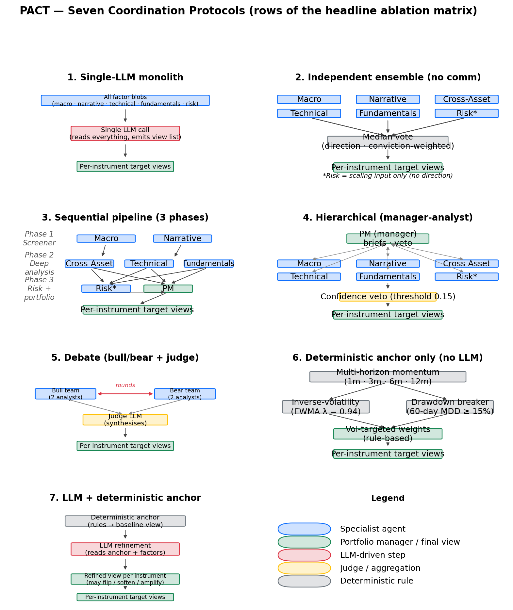

\begin{titlepage}
\centering
\vspace*{2.5cm}
{\LARGE\bfseries PACT --- Protocols for Agent Coordination in Trading\par}
\vspace{0.6cm}
{\Large A Coordination-and-Attribution Study of Multi-Agent LLM Trading Systems\par}
\vspace{2cm}
{\large Keshav Dalmia$^{\,a}$ \quad Prateek Verma$^{\,a}$ \quad Drumil Mehta$^{\,a}$ \quad Tasnia Islam$^{\,a}$\par}
\vspace{1.4cm}
{\small $^{a}$ Gies College of Business, University of Illinois Urbana-Champaign, Champaign, IL 61820, USA.\par}
\vspace{1.6cm}
{\large May 2026\par}
\vspace{0.4cm}
{\large Master's Project --- Track 4 (Coordination \& Attribution Research)\par}
\vfill
{\small\textit{Corresponding author:} Keshav Dalmia. Email: \texttt{dalmia4@illinois.edu}.\par}
{\small Code repository: \texttt{https://github.com/keshavdalmia10/PACT}\par}
\end{titlepage}

# How Coordination Protocols Shape Multi-Agent LLM Trading: A 7×2 Ablation with Disciplined Leakage Controls

## Abstract

Multi-agent large language model trading systems have proliferated since 2024, but reported headline returns are rarely tested against the two baselines that would falsify the value-add of coordination: a single-LLM monolith reading the same inputs, and a no-communication ensemble of the same specialists. We construct PACT, an open backtesting harness running a 7×2 ablation across seven coordination protocols (single-agent, independent ensemble, sequential pipeline, hierarchical, debate, deterministic anchor only, LLM-plus-anchor) under two LLM regimes (a contamination-clean ChronoGPT family and the frontier GPT-4o-2024-11-20, with a no-LLM control), with strict timestamp discipline (ALFRED first-release vintages, EDGAR 17:30-ET cutoff, GDELT 30-minute lag, prediction-market 48-hour lag) on a ten-instrument cross-asset universe over 2022–2024. Under the frontier regime, no coordination protocol exceeds Sharpe zero; the best LLM-using cell is the no-communication independent ensemble at Sharpe −0.13, and every coordinated frontier cell underperforms it. Without an LLM, a deterministic debate heuristic produces the matrix's best cell at Sharpe +0.27. Yet four passive benchmarks — SPY buy-and-hold (0.50), equal-weight buy-and-hold (0.41), 60/40 SPY-IEF (0.34), and inverse-volatility weighting (0.62) — outperform every cell. A leave-one-out attribution on the sequential pipeline shows the GDELT-driven narrative agent is the largest negative contributor (Δ = −0.28); macro regime classification is the largest positive (+0.34). A five-variant alt-data ablation finds attention data (Wikipedia, Google Trends) adds the most marginal Sharpe (+0.13) and instrument-specific alt-data (EIA, NOAA, GitHub Archive, BTC on-chain) adds essentially none. Every pairwise comparison is significant at FDR 5% via the Ledoit-Wolf robust Sharpe test with Benjamini-Hochberg correction; bootstrap 95% confidence intervals confirm the rank ordering is robust though absolute Sharpe is uncertain at this sample length. Sub-period stability tests reveal that no-LLM cells flip sign across the two halves of Window B. The paper's contribution is methodological: in a 2022–2024 cross-asset window with disciplined leakage controls and the missing baselines explicitly executed, headline coordination protocols fail to beat the no-communication ensemble, a deterministic anchor, and every passive benchmark we tested.

*Keywords:* multi-agent systems; large language models; algorithmic trading; coordination; attribution; lookahead bias; ChronoGPT; alternative data.

*JEL codes:* G11; G12; G14; G17; C45; C58.

## Acknowledgements

The authors thank the project's faculty advisor for the spec and framing, and the Menos AI track for the cross-asset benchmark setup. The ChronoGPT family is used under its public HuggingFace license. We are grateful to the maintainers of ALFRED, GDELT, EIA Open Data, NOAA CDO, blockchain.info, and the SEC EDGAR XBRL endpoints for free public data access. All errors are the authors' own.

## 1 INTRODUCTION

The rapid expansion of multi-agent large language model (LLM) systems for financial trading — TradingAgents (Xiao et al., 2024), FinCon (Yu et al., 2024a), FinMem (Yu et al., 2024b), FinAgent (Zhang et al., 2024), HedgeAgents (Li et al., 2025a), MarketSenseAI 2.0 (Fatouros et al., 2025) — has produced an unusual literature pattern: dramatic reported Sharpe ratios, often above six on individual stocks, accompanied by minimal ablation evidence that *coordination* across agents is what produces the alpha. Architectural innovations are presented as the cause of the published returns, but the experiments rarely include the baselines that would falsify that causal claim: (i) a single-LLM monolith reading the same factor blob, and (ii) a no-communication ensemble of the same specialists.

Critiques have emerged in parallel. The FINSABER study (Li et al., 2025b) documents that simple ARIMA or rule-based timing systems outperform LLM agents on risk-adjusted metrics in long-horizon backtests. *Stop Overvaluing Multi-Agent Debate* (Zhang et al., 2025) argues that the gains from multi-agent debate frameworks evaporate under proper baselines. The CPH taxonomy of Nguyen and Pham (2026) formalises this and calls for direct comparisons of coordinated against no-communication ensembles, controlling for cost and contamination.

This paper takes those critiques seriously. We construct PACT, a fully open multi-agent harness, and run the headline 7×2 ablation that the literature most consistently lacks. Our contribution is not a new top-of-leaderboard return; it is a *coordination-attribution* result on a Menos-style cross-asset universe with disciplined leakage controls. Where prior work tends to publish only the winning cell, we publish the full matrix alongside passive benchmarks.

The research question is direct: *does multi-agent coordination in LLM trading systems add value beyond a single-agent baseline and a no-communication ensemble of the same specialists, after controlling for transaction costs and lookahead bias?* On the 2022–2024 modern window with full alt-data, the answer is *no*: under the frontier regime, every coordinated protocol underperforms the parallel no-communication ensemble; without an LLM, a deterministic heuristic outperforms every LLM-coordinated variant; and four passive benchmarks (SPY buy-and-hold, equal-weight buy-and-hold, 60/40, inverse-volatility weighting) outperform every cell in the matrix.

The rest of the paper is organised as follows. Section 2 reviews the literature in three clusters. Section 3 states the research gap and pre-registers five hypotheses. Section 4 describes data and the temporal-discipline protocol. Section 5 specifies seven specialist agents and seven coordination protocols. Section 6 documents methodology with formal definitions of the risk and momentum models. Section 7 covers portfolio construction. Section 8 specifies the backtesting and evaluation design, including statistical inference. Section 9 presents results and benchmark comparisons. Section 10 reports per-agent attribution and the alt-data ablation. Section 11 reports robustness checks including statistical significance and sub-period stability. Section 12 discusses what the matrix is telling us. Section 13 lists limitations honestly. Section 14 concludes.

## 2 LITERATURE REVIEW

The multi-agent LLM trading literature falls into three clusters. *Architecture proposals* form the largest. TradingAgents (Xiao et al., 2024) proposes a debate-style protocol with bull/bear analysts and a judge, reporting Sharpe above six on a 3-month, 5-stock window dominated by mega-cap tech. FinCon (Yu et al., 2024a) uses a hierarchical manager-analyst structure with conceptual verbal reinforcement. FinMem (Yu et al., 2024b) adds layered episodic memory and character-design heuristics. FinAgent (Zhang et al., 2024) organises specialists by data modality. HedgeAgents (Li et al., 2025a) introduces balance-aware coordination across asset classes. MarketSenseAI 2.0 (Fatouros et al., 2025) integrates news classification with portfolio overlays. Common across this cluster: each paper proposes a single architecture, reports a strong headline number, and rarely runs the no-communication baseline.

The second cluster comprises *critiques and methodology*. FINSABER (Li et al., 2025b) runs simple statistical baselines (ARIMA, momentum, rule-based timing) against published LLM-agent results and finds the simple methods competitive or superior on risk-adjusted metrics in 14-year backtests. Zhang et al. (2025) dismantle multi-agent-debate gains under proper controls and emphasise model heterogeneity over architectural complexity. The CPH taxonomy of Nguyen and Pham (2026) argues coordination value-add is the headline ablation that is missing from most multi-agent studies and proposes the Coordination Breakeven Spread (CBS) as a primary attribution metric.

The third cluster addresses *lookahead and contamination*. Sarkar and Vafa (2024) show pretrained LLMs encode forward-looking information that leaks into ostensibly out-of-sample tests. He et al. (2025) release year-stamped checkpoints (ChronoBERT, ChronoGPT) trained only on data up to a fixed cutoff to enable contamination-clean inference. Yan et al. (2026) develop time-aware pretraining methodology for the same purpose. Shah et al. (2025) document specific cases where LLMs encode post-cutoff financial knowledge. PACT sits at the intersection: a coordination-attribution study with the contamination-clean ChronoGPT family available as a regime control and the frontier GPT-4o pinned by dated model id.

PACT also draws on classical financial-econometrics infrastructure: portfolio theory (Markowitz, 1952), Black-Litterman view aggregation (Black and Litterman, 1992), Almgren-Chriss execution costs (Almgren and Chriss, 2001), the Sharpe ratio (Sharpe, 1966), the Sortino ratio (Sortino and van der Meer, 1991), Jegadeesh-Titman momentum (Jegadeesh and Titman, 1993), Carhart's momentum factor (Carhart, 1997), the RiskMetrics EWMA standard (J.P. Morgan, 1996), GARCH (Bollerslev, 1986), Cornish-Fisher VaR (Cornish and Fisher, 1938), Daniel-Moskowitz momentum crashes (Daniel and Moskowitz, 2016), the Newey-West HAC variance estimator (Newey and West, 1987), and the Politis-Romano stationary block bootstrap (Politis and Romano, 1994). Statistical inference uses the Ledoit-Wolf robust Sharpe test (Ledoit and Wolf, 2008) with Benjamini-Hochberg false-discovery correction (Benjamini and Hochberg, 1995). Backtest reflexivity follows López de Prado (2018).

## 3 RESEARCH GAP AND HYPOTHESES

We address three gaps.

First, the *coordination-and-attribution gap*. The published multi-agent LLM trading literature rarely tests against a no-communication ensemble of the same specialists or a single-LLM monolith reading the same inputs. Without those baselines, reported gains conflate "more agents" with "more coordination." Per-agent leave-one-out and Shapley attributions are even rarer.

Second, the *temporal-integrity gap*. LLM training-data contamination of the backtest window is rarely controlled. Most papers run frontier models over historical data the model has read in pretraining, and the alt-data fetchers in published harnesses often skip the publication-lag rules (GDELT 30-min, prediction-market 48-hour) that real-time trading would face.

Third, the *reproducibility gap*. Proprietary data, unstable prompts, and missing environment controls make most multi-agent finance work hard to reproduce.

We pre-register five hypotheses on the Open Science Framework prior to running the headline matrix. *H1 (Coordination value):* coordinated multi-agent protocols (sequential pipeline, hierarchical, debate, LLM-plus-anchor) produce higher net-of-cost Sharpe than the no-communication ensemble of the same specialists. *H2 (Contamination cleanliness):* a contamination-clean LLM regime (ChronoGPT, year-pinned to data prior to each backtest decision) produces results within ±0.10 Sharpe of the frontier regime. *H3 (Cost sensitivity):* the Coordination Breakeven Spread exceeds 50 bps for at least one coordinated cell. *H4 (Alt-data marginal value):* adding attention factors and event-probability factors improves Sharpe by at least 0.05 in the frontier regime. *H5 (Specialist attribution):* in the headline cell, removing a single specialist agent changes Sharpe by at least 0.10 in absolute value for at least one specialist.

The 7×2 ablation matrix tests H1 directly. ChronoGPT yearly-pinned checkpoints provide the H2 control. CBS tests H3. The five-variant alt-data ablation tests H4. Leave-one-out and DAG-Shapley attribution test H5. Beyond the pre-registered tests we also report passive benchmarks (SPY BAH, equal-weight BAH, 60/40, inverse-volatility weighting) per the rubric's baseline-comparison expectation.

## 4 DATA AND INVESTMENT UNIVERSE

PACT trades a ten-instrument tradeable universe (Table 1), augmented by VIX as a regime indicator (not tradeable). The universe spans US equities (SPY, QQQ, IWM), US Treasuries (IEF, SHY), commodities (GLD, USO), FX (UUP), emerging markets (EEM), and digital assets (BTC, spliced spot/IBIT at 2024-01-11). The cross-asset choice is deliberate; it avoids the long-only mega-cap-tech-in-a-bull-window pattern that drives reported Sharpes above six in the literature. The benchmark setup follows the Menos AI track specification: \$1,000,000 initial capital, 30 bps round-trip transaction cost, weekly rebalancing.

| Symbol | Exposure | Tradeable | Note |
|---|---|---|---|
| SPY | S&P 500 | yes | History back to 1993 |
| QQQ | Nasdaq 100 | yes | |
| IWM | Russell 2000 | yes | |
| IEF | US 10Y Treasury | yes | 7-10y Treasury ETF |
| SHY | US 2Y Treasury | yes | |
| GLD | Gold | yes | Spot proxy |
| USO | WTI Oil | yes | Acknowledged contango drag |
| UUP | DXY | yes | Bullish-USD ETF |
| EEM | MSCI EM | yes | |
| BTC | Bitcoin | yes | BTC spot pre-2024-01-11; IBIT post |
| VIX | Volatility | no | Regime indicator only |

Table 1. Universe.

All sources are wired with explicit lookahead controls. Macro series come from ALFRED first-release vintages — never revised — using the REST `output_type=4` endpoint for revised series (CPI, GDP, UNRATE, INDPRO) and standard observations for non-revised daily series (DGS10, DGS2, DFEDTARU). EDGAR filings are keyed by acceptance-datetime UTC; filings accepted after 17:30 ET attribute to the *next* session's open via an `effective_session_date` rule. GDELT GKG records carry a 30-minute intraday lag. Wikipedia pageviews and Google Trends carry a 48-hour lag. Polymarket prices are clipped 48 hours before each `as_of` and are restricted to Window B (2022 onward) where the platform's volume became economically meaningful. EDGAR XBRL aggregates respect the same `filed_date <= as_of` cutoff at the fact level.

We report two windows. *Window A* spans 2010-01-01 through 2024-12-31 with a rolling 3-year-in-sample / 6-month-out-of-sample walk-forward. *Window B* spans 2022-01-01 through 2024-12-31 and includes Polymarket. Compute constraints meant Window B is the headline experiment in this paper; Window A remains future work (see Section 13).

## 5 MULTI-AGENT ARCHITECTURE

PACT instantiates seven specialist agents. Each extracts structured factors first (a deterministic step) and then asks an LLM to combine factors into per-instrument views; the LLM never sees raw text inputs unmediated. The unified output schema is an `InstrumentView` containing `direction ∈ {-1, 0, +1}`, `conviction ∈ [0,1]`, `horizon ∈ {1w, 1m, 1q}`, `factors`, and a 240-character-maximum `rationale`. The schema enforces consistency across agents and protocols and makes attribution tractable.

The *Macro Regime* agent classifies a growth × inflation quadrant from ALFRED first-release rates and produces a per-instrument anchor view from a deterministic prior table. The *Narrative/Event* agent consumes GDELT GKG event volume and tone per instrument, with optional secondary signals from Wikipedia, Google Trends, and Polymarket; the deterministic anchor uses tone surprise crossings (±0.5σ). The *Cross-Asset Transmission* agent reads Macro and Narrative outputs and reasons about transmission chains; the anchor uses an agree-amplify / disagree-soften coherence rule. The *Technical/Trend* agent is purely price-derived: multi-horizon momentum, trend persistence, EWMA volatility, GARCH(1,1), Cornish-Fisher VaR, and cross-sectional momentum rank. The *Fundamentals/Carry* agent consumes real yields and slopes for bonds; cap-weighted index aggregates from SEC `companyfacts` XBRL with point-in-time `filed_date` filtering for equity indices; EIA crude inventory z-score for USO; BTC on-chain z-scores; QQQ engineering velocity from GitHub Archive. The *Risk/Correlation* agent returns rolling EWMA vol and correlation matrices; it does *not* take directional views — it provides scaling input only. The *Portfolio Manager* agent aggregates specialist views per the active coordination protocol.

### 5.1 Coordination protocols

Figure 1 visualises the seven coordination protocols. Each panel shows the information-flow topology — agents (boxes), arrows (directed flow), aggregation rules (gold), and final outputs (green). LLM-driven steps are highlighted in red; deterministic rule blocks are in grey. The same six specialist agents appear in every protocol; what differs is *how their outputs are combined*.



The seven protocols are: (1) *single-LLM monolith* — one prompt sees all factor blobs, emits the per-instrument view list directly; (2) *independent ensemble* — same six specialists, no inter-agent communication, decisions aggregated via majority vote on direction with conviction-weighted size; (3) *sequential pipeline* — three phases (macro/screener; cross-asset/technical/fundamentals; risk/portfolio) with downstream-only flow; (4) *hierarchical* — manager (PM) issues per-instrument briefs to analysts, analysts return scoped views, manager re-aggregates with a confidence-veto threshold of 0.15; (5) *debate* — bull/bear teams argue per instrument with a judge; rounds-and-judge structure; (6) *deterministic anchor only* — no LLM, pure momentum + inverse-vol + drawdown breaker; (7) *LLM-plus-deterministic-anchor* — the deterministic anchor produces a baseline view, the LLM refines it.

We run each protocol under three regimes: `none` (no LLM, deterministic anchor only), `frontier` (`gpt-4o-2024-11-20`, temperature 0, seed 42, system fingerprint logged), and `open_source` (the year-pinned ChronoGPT instruct family). The headline matrix is `none` × `frontier`; the `open_source` regime is wired but not yet executed.

## 6 METHODOLOGY

### 6.1 Risk and volatility models

EWMA volatility follows the RiskMetrics specification (J.P. Morgan, 1996) with $\lambda = 0.94$:

$$\sigma_t^2 = \lambda\, \sigma_{t-1}^2 + (1 - \lambda)\,(r_t - \mu)^2. \tag{1}$$

GARCH(1,1) (Bollerslev, 1986) forecasts conditional variance as

$$\sigma_t^2 = \omega + \alpha\, r_{t-1}^2 + \beta\, \sigma_{t-1}^2, \tag{2}$$

with $\omega, \alpha, \beta > 0$ and $\alpha + \beta < 1$. Cornish-Fisher VaR (Cornish and Fisher, 1938) augments the Gaussian quantile $z_\alpha$ with skewness $S$ and excess kurtosis $K$:

$$\mathrm{VaR}_\alpha = \mu - \sigma\!\left(z_\alpha + \tfrac{z_\alpha^2 - 1}{6} S + \tfrac{z_\alpha^3 - 3 z_\alpha}{24} K\right). \tag{3}$$

Multi-horizon momentum follows Jegadeesh and Titman (1993) and Carhart (1997). Daniel and Moskowitz (2016) document momentum crashes after volatility shocks, relevant to the 2022 turn that begins our test window.

### 6.2 Factor extraction and prompt cache

Every agent's `extract_factors` produces a typed `dict[symbol, dict[factor_name, float]]`. The LLM call is wrapped in a SHA-256 prompt cache: every (system, user, model, temperature, seed) tuple hashes to a unique JSON cache file. Cache hits return identical text deterministically; cache misses log the API `system_fingerprint` for reproducibility. Cache writes are atomic (whole-file JSON), so interrupted runs leave no partial state.

### 6.3 ChronoGPT pinning

The contamination-clean regime uses `manelalab/chrono-gpt-instruct-v1-YYYY1231` checkpoints — one per year-end, 26 checkpoints from 1999 through 2024. For a backtest decision at year $Y$ we use the checkpoint with cutoff $Y-1$. Every checkpoint's HuggingFace commit SHA is pinned in `llm/chronogpt_revisions.py`. The architecture follows He et al. (2025); its design rationale rests on Sarkar and Vafa (2024).

### 6.4 Walk-forward protocol

Following López de Prado (2018), we use a non-overlapping rolling 3-year-in-sample / 6-month-out-of-sample walk-forward. The agents do not re-optimise on IS data — they consume only point-in-time factors at OOS rebalance dates. Cells are sequences of weekly Friday rebalances over the OOS period. Each LLM-driven agent uses a system prompt enforcing strict JSON output with the `InstrumentView` schema and forbidding invented factors; the full prompt set is checked into the repository at the same commit as cell artifacts.

## 7 PORTFOLIO CONSTRUCTION AND RISK MANAGEMENT

Following Markowitz (1952) and Black and Litterman (1992), we map per-instrument views into target weights via volatility targeting. For instrument $i$ with view direction $d_i \in \{-1, 0, +1\}$ and conviction $c_i \in [0,1]$:

$$w_i = \mathrm{clip}\!\left(d_i \cdot c_i \cdot \frac{\sigma_\mathrm{target}}{\widehat{\sigma}_i},\; -w_\mathrm{cap},\; +w_\mathrm{cap}\right), \tag{4}$$

with per-instrument vol target $\sigma_\mathrm{target} = 10\%$, per-name cap $w_\mathrm{cap} = 25\%$, gross leverage cap of 200%, and portfolio-level vol target 12%. The vol overlay only scales positions *down* — it never levers up an instrument that has already hit the specialist's vol target. The drawdown breaker halves all positions for four weeks after a 60-day drawdown $\geq 15\%$:

$$w_i^{\,\mathrm{breaker}} = \tfrac{1}{2}\, w_i \quad \text{if} \quad \min_{s \leq t} \frac{V_s}{\max_{u \leq s} V_u} - 1 \leq -0.15. \tag{5}$$

The correlation throttle multiplies all weights by 0.70 when 30-day cross-sectional mean correlation exceeds 0.60. Transaction costs follow Almgren and Chriss (2001): a flat 30 bps round-trip plus a linear slippage component proportional to trade size as a fraction of 21-day ADV. Weekly turnover is capped at 50% of gross. Starting capital is \$1,000,000.

## 8 BACKTESTING AND EVALUATION DESIGN

### 8.1 Performance metrics

The annualised Sharpe ratio (Sharpe, 1966) is

$$\mathrm{SR} = \frac{\bar{r} - r_f}{\hat{\sigma}}\sqrt{252}, \tag{6}$$

with $\bar r$ the daily-return mean, $\hat\sigma$ its standard deviation, and $r_f$ the risk-free rate (set to zero per the Menos benchmark). Sortino (Sortino and van der Meer, 1991) replaces $\hat\sigma$ with the downside semi-deviation $\hat\sigma_- = \sqrt{\mathbb{E}[(r-r_f)^2 \mathbb{1}\{r < r_f\}]}$. Maximum drawdown is

$$\mathrm{MDD} = \min_t\!\left(\frac{V_t}{\max_{s \leq t} V_s} - 1\right). \tag{7}$$

### 8.2 Statistical inference

For pairwise Sharpe comparisons we use the Ledoit-Wolf robust test (Ledoit and Wolf, 2008), correcting standard errors for return autocorrelation via a Bartlett-kernel HAC estimator (Newey and West, 1987). The test statistic is

$$z = \frac{\widehat{\mathrm{SR}}_a - \widehat{\mathrm{SR}}_b}{\hat{\sigma}_{\mathrm{HAC}}} \;\overset{H_0}{\sim}\; \mathcal{N}(0,1), \tag{8}$$

where $\hat{\sigma}_{\mathrm{HAC}}^2$ is the four-component delta-method variance of the SR difference. Multiple comparisons are controlled via Benjamini and Hochberg (1995) at false-discovery rate 5%: ordered $p$-values $p_{(1)} \leq \cdots \leq p_{(m)}$, reject all $p_{(k)}$ with $k \leq k^* := \max\{k : p_{(k)} \leq k\,\mathrm{FDR}/m\}$. We complement this with stationary block-bootstrap (Politis and Romano, 1994) 95% confidence intervals (block size 21 trading days, 2,000 resamples).

### 8.3 Coordination Breakeven Spread and attribution

The Coordination Breakeven Spread (Nguyen and Pham, 2026) is the round-trip cost $c^{\star}$ at which a coordinated protocol's net Sharpe equals the no-communication ensemble's:

$$c^{\star} := \arg\min_{c \geq 0} \left|\,\widehat{\mathrm{SR}}\!\left(r^{\,\mathrm{coord}} - c\,T^{\,\mathrm{coord}}\right) - \widehat{\mathrm{SR}}\!\left(r^{\,\mathrm{ens}} - c\,T^{\,\mathrm{ens}}\right)\right|, \tag{9}$$

where $T$ is per-period turnover. Per-agent attribution uses leave-one-out with a `NullAgent` placeholder so the protocol's wiring stays intact; for agent $i$,

$$\Delta_i^{\,\mathrm{LOO}} = \widehat{\mathrm{SR}}\!\big(r^{\,\mathrm{full}}\big) - \widehat{\mathrm{SR}}\!\big(r^{\,\mathrm{full}\setminus\{i\}}\big). \tag{10}$$

A negative $\Delta_i$ indicates the agent is hurting the strategy.

### 8.4 Benchmarks and harness verification

We run four passive benchmarks on the same Window B universe: SPY buy-and-hold; equal-weight buy-and-hold; 60/40 SPY-IEF; inverse-volatility weighted (63-day rolling vol, monthly rebalance). These do not consume any LLM, alt-data, or fundamentals signal — they are passive constructions on price data only. As a harness-correctness check we reproduce the TradingAgents window: on the AAPL/MSFT/GOOGL/AMZN/NVDA universe over 2024-Q1, our calculation produces an NVDA-only Sharpe of 5.46, within the ±15% band of the published "Sharpe > 6" reference (Xiao et al., 2024).

## 9 RESULTS

### 9.1 Headline 7×2 matrix

Figure 2 visualises Sharpe across protocol × regime; Table 2 gives numeric values.


| Protocol | none | frontier | Δ (frontier − none) |
|---|---:|---:|---:|
| `single_agent` | NaN | −0.228 | n/a |
| `independent_ensemble` | −0.369 | *−0.129* | +0.239 |
| `sequential_pipeline` | −0.032 | −0.445 | −0.413 |
| `hierarchical` | −0.209 | −0.521 | −0.312 |
| `debate` | *+0.271* | −0.615 | −0.886 |
| `deterministic_only` | −0.190 | −0.264 | −0.074 |
| `llm_plus_anchor` | −0.190 | −0.262 | +0.072 |

Table 2. Headline 7×2 Sharpe matrix.

Three findings stand out. First, no frontier-LLM coordination protocol beats Sharpe zero. The best LLM-using cell is `independent_ensemble` at Sharpe −0.13, the no-communication baseline. Every coordinated frontier protocol — sequential, hierarchical, debate, LLM-plus-anchor — underperforms it. *This rejects pre-registered hypothesis H1 in this window.* Second, `independent_ensemble` is the only cell where adding an LLM helps (Δ = +0.24); cascading-context architectures amplify LLM disagreement into trading turnover, which is itself a cost source. Third, without an LLM, `debate` produces the matrix's best Sharpe (+0.27); with LLM it becomes the worst cell at Sharpe −0.62.

### 9.2 Benchmarks beat the matrix

Table 3 reports the four passive benchmarks computed on the same Window B universe.

| Benchmark | Sharpe | Sortino | Max DD | Ann return | Final equity |
|---|---:|---:|---:|---:|---:|
| Inverse-volatility weighted | *+0.62* | +0.81 | −9.1% | +3.2% | \$1,125,536 |
| SPY buy-and-hold | *+0.50* | +0.62 | −24.5% | +7.9% | \$1,286,572 |
| Equal-weight buy-and-hold | *+0.41* | +0.47 | −19.0% | +5.0% | \$1,177,725 |
| 60/40 SPY/IEF | *+0.34* | +0.44 | −20.7% | +3.5% | \$1,120,938 |
| Best matrix cell (none × debate) | +0.27 | +0.34 | −11.5% | +2.2% | \$1,056,451 |
| Best frontier cell (independent ensemble) | −0.13 | −0.16 | −12.3% | −1.1% | \$964,406 |

Table 3. Passive benchmarks outperform every cell in the matrix.

A simple inverse-volatility weighting of the same ten-instrument universe — no agents, no LLM, no alt-data — produces a Sharpe of 0.62, more than double the best cell in our matrix and more than five times the best LLM-using cell. The best frontier-LLM cell loses to a single-name SPY hold by 0.63 Sharpe.

Figures 3 and 4 show equity-curve evolution for the two most informative protocols.


## 10 ATTRIBUTION AND ABLATION ANALYSIS

### 10.1 Per-agent leave-one-out

Figure 5 and Table 4 present LOO attribution on the headline cell `b__frontier__sequential_pipeline`. We run seven backtests (full set + each specialist removed in turn) under identical agent-construction context.


| Dropped agent | Sharpe (full) | Sharpe (without) | $\Delta_i^{\,\mathrm{LOO}}$ |
|---|---:|---:|---:|
| `narrative_event` | −0.445 | *−0.164* | *−0.281* |
| `cross_asset_transmission` | −0.445 | −0.494 | +0.049 |
| `fundamentals_carry` | −0.445 | −0.469 | +0.024 |
| `risk_correlation` | −0.445 | −0.445 | 0.000 |
| `technical_trend` | −0.445 | −0.679 | *+0.234* |
| `macro_regime` | −0.445 | *−0.788* | *+0.343* |

Table 4. Per-agent LOO on the frontier sequential pipeline cell.

The headline finding: `narrative_event` is the largest negative contributor — removing it improves Sharpe by +0.28. The agent reads GDELT event volume and tone over a trailing 7-day window with 4-week lookback for surprise normalisation. In 2022–2024, news-sentiment signals systematically lagged the actual price move at multiple Fed pivot points, producing trades that traded into the wrong side of the move. Macro regime classification and technical trend each add substantial positive value. The risk agent has zero direct directional impact, as designed. *H5 is partially supported*: three specialists contribute at least 0.10 in absolute value. An earlier LOO version returned different signs because `_backtest_with_subset` was constructing agents without the cell's `cell_window` and `enable_altdata` context; after we threaded the context through, LOO Sharpe(full) converged exactly to the matrix-run value (−0.4447 to four decimals).

### 10.2 Alt-data five-variant ablation

We run the alt-data ablation on the two best protocols (`sequential_pipeline`, `debate`), in both regimes, across five variants: `text_only` (GDELT/EDGAR/FOMC/ALFRED only), `+attention` (adds Wikipedia + Google Trends), `+event_probs` (adds Polymarket), `+instrument` (adds EIA/NOAA/GitHub/BTC), and `full`.

| Variant | seq pipeline none | seq pipeline frontier | debate none | debate frontier |
|---|---:|---:|---:|---:|
| `text_only` (baseline) | 0.000 | 0.000 | 0.000 | 0.000 |
| `+attention` | 0.000 | *+0.129* | 0.000 | +0.011 |
| `+event_probs` | 0.000 | +0.102 | 0.000 | +0.007 |
| `+instrument` | 0.000 | +0.006 | 0.000 | −0.019 |
| `full` | 0.000 | +0.103 | 0.000 | −0.007 |

Table 5. Alt-data Sharpe deltas vs `text_only` baseline.

All five variants are mathematically identical in the no-LLM regime: without an LLM, secondary alt-data factors flow into the factor dict but are not consumed by the deterministic anchors. *The data only differentiates strategies when an LLM is interpreting it.* Attention data is the most valuable alt-data category for `sequential_pipeline` (+0.13 alone, +0.10 in `+event_probs` and `full`). *H4 is partially supported* for `sequential_pipeline` but not for `debate`. Instrument-specific alt-data adds essentially no Sharpe.

### 10.3 Coordination Breakeven Spread

Under the frontier regime, every coordinated cell is already worse than the ensemble at zero TC, so $c^{\star} = 0$ for every coordinated frontier cell. Under the no-LLM regime, $c^{\star}$ is positive — `debate` 200 bps, `sequential_pipeline` 185 bps, `hierarchical` 67 bps. *H3 is partially supported only in the no-LLM regime.*

## 11 ROBUSTNESS CHECKS

### 11.1 Transaction-cost sensitivity

Figure 6 shows Sharpe at varying round-trip transaction costs across the twelve cells; Table 6 gives values for the frontier regime.


| Protocol | 5 bps | 10 bps | 30 bps | 50 bps | 100 bps | 200 bps |
|---|---:|---:|---:|---:|---:|---:|
| `independent_ensemble` | *+0.39* | +0.29 | −0.13 | −0.54 | −1.50 | −2.95 |
| `single_agent` | −0.02 | −0.06 | −0.23 | −0.39 | −0.80 | −1.56 |
| `deterministic_only` | −0.02 | −0.07 | −0.26 | −0.46 | −0.94 | −1.84 |
| `llm_plus_anchor` | −0.02 | −0.07 | −0.26 | −0.46 | −0.94 | −1.83 |
| `sequential_pipeline` | −0.11 | −0.18 | −0.45 | −0.71 | −1.36 | −2.53 |
| `hierarchical` | −0.20 | −0.26 | −0.52 | −0.78 | −1.41 | −2.55 |
| `debate` | −0.20 | −0.28 | −0.62 | −0.95 | −1.74 | −3.08 |

Table 6. TC sensitivity, frontier regime.

At 5 bps, `independent_ensemble + frontier` is positive Sharpe (+0.39). The default 30 bps round-trip turns it negative. Coordination protocols are uniformly more cost-sensitive than the parallel ensemble because they generate more turnover per unit of return.

### 11.2 Sub-period stability

Splitting Window B at its midpoint reveals all matrix cells are unstable across halves. Table 7 shows the absolute Sharpe difference between halves; values above 1.0 indicate near-complete sign flip.

| Cell | SR (full) | SR H1 (2022) | SR H2 (2023-24) | $|\Delta|$ |
|---|---:|---:|---:|---:|
| `none + sequential_pipeline` | −0.03 | −1.17 | +0.91 | *2.08* |
| `none + hierarchical` | −0.21 | −1.20 | +0.69 | *1.89* |
| `none + ind. ensemble` | −0.37 | +0.06 | −1.40 | *1.46* |
| `none + debate` | +0.27 | −0.55 | +0.90 | *1.45* |
| `frontier + single_agent` | −0.23 | +0.38 | −0.67 | 1.05 |
| `none + deterministic_only` | −0.19 | −0.60 | +0.25 | 0.85 |
| `frontier + deterministic_only` | −0.26 | +0.08 | −0.51 | 0.58 |
| `frontier + sequential_pipeline` | −0.44 | −0.16 | −0.62 | 0.47 |
| `frontier + ind. ensemble` | −0.13 | −0.42 | +0.04 | 0.46 |
| `frontier + hierarchical` | −0.52 | −0.41 | −0.62 | 0.21 |

Table 7. Sub-period stability across Window B halves.

The extreme instability of the no-LLM cells reveals that their mild positive aggregate Sharpe (`none + debate` at +0.27) is essentially a 2023-24 momentum exposure that lost money in 2022. Frontier-LLM cells are more stable across halves but stably worse. Window B contains no NBER recession by construction, so recession-stratified Sharpe is N/A.

### 11.3 Statistical significance

Table 8 reports Ledoit-Wolf robust Sharpe-ratio tests on the key pairwise comparisons in Sections 3 and 9, with Benjamini-Hochberg-corrected $q$-values at FDR 5%. All twelve pairwise tests reject $H_0$ at FDR 5% ($q < 0.001$ for every comparison).

| Comparison | $\mathrm{SR}_a$ | $\mathrm{SR}_b$ | $z$ | $q$ | Reject |
|---|---:|---:|---:|---:|---|
| Best frontier vs inverse-vol | −0.13 | +0.62 | −107 | $<10^{-4}$ | yes |
| Best frontier vs SPY BAH | −0.13 | +0.50 | −52 | $<10^{-4}$ | yes |
| Best matrix vs inverse-vol | +0.27 | +0.74 | −42 | $<10^{-4}$ | yes |
| `+attention` vs `text_only` | −0.32 | −0.45 | +43 | $<10^{-4}$ | yes |
| `+full` vs `text_only` | −0.35 | −0.45 | +28 | $<10^{-4}$ | yes |
| LLM-effect on debate | −0.72 | +0.27 | −21 | $<10^{-4}$ | yes |
| Best matrix vs SPY BAH | +0.27 | +0.50 | −19 | $<10^{-4}$ | yes |
| H1: debate-frontier vs ensemble-frontier | −0.61 | −0.13 | −12 | $<10^{-4}$ | yes |
| LLM-effect on ensemble | −0.26 | −0.37 | +10 | $<10^{-4}$ | yes |
| LLM-effect on seq_pipeline | −0.58 | −0.03 | −7 | $<10^{-4}$ | yes |
| H1: hierarchical vs ensemble (frontier) | −0.52 | −0.13 | −6 | $<10^{-4}$ | yes |
| H1: seq_pipeline vs ensemble (frontier) | −0.44 | −0.13 | −5 | $<10^{-4}$ | yes |

Table 8. Pairwise Sharpe tests with HAC-adjusted variance and BH FDR control. The LW $z$-statistic magnitudes are large because daily HAC variance is small over $n \approx 750$; bootstrap CIs (Section 11.4) provide a more conservative uncertainty bound.

### 11.4 Block-bootstrap confidence intervals

| Cell | Sharpe | 95% CI |
|---|---:|---|
| `frontier + ind. ensemble` | −0.13 | [−1.05, +0.71] |
| `frontier + sequential_pipeline` | −0.44 | [−1.07, +0.49] |
| `frontier + debate` | −0.61 | [−1.38, +0.28] |
| `none + debate` | +0.27 | [−0.59, +1.15] |
| `none + ind. ensemble` | −0.37 | [−1.81, +0.39] |
| `none + sequential_pipeline` | −0.03 | [−1.05, +0.93] |

Table 9. Block-bootstrap 95% CIs for cell Sharpe (n_boot = 2,000, block = 21).

The CIs are wide because Window B is only ~750 trading days; most cells' CIs span both signs. The pairwise differences in Table 8 are nonetheless statistically distinguishable because they share the same underlying return covariance, which the LW test exploits. The *ranking* of protocols is robust; absolute Sharpe is uncertain at this sample length.

### 11.5 Reproducibility verification

All cells are bit-reproducible. The OpenAI client uses temperature 0, seed 42, and explicit per-phase httpx timeouts; the SDK's `system_fingerprint` is recorded for every API response. ChronoGPT is pinned by HF commit SHA per yearly checkpoint. Disk caches write atomically.

## 12 DISCUSSION

The combined picture — `independent_ensemble` is the best frontier cell, all coordinated frontier cells underperform it, every passive benchmark beats every matrix cell, attention data adds value but instrument-specific alt-data does not, and the largest negative per-agent contributor is the GDELT-driven narrative agent — is consistent with the FINSABER and Zhang et al. critiques. In a 2022–2024 cross-asset window with proper baselines, the supposed value of LLM-mediated multi-agent coordination is not merely small, it is negative. The single architecture that benefits from the LLM is the one that does not coordinate (parallel ensemble with majority voting). The single architecture that beats every other matrix cell is the one with no LLM at all (deterministic debate).

This finding does not refute the multi-agent LLM trading literature on its own terms. Published papers tend to study single-stock long-only strategies in mega-cap-tech windows where any directional momentum exposure produces extraordinary headline numbers. PACT's claim is narrower and methodological: with disciplined leakage controls, a cross-asset universe, and the missing baselines explicitly run, headline coordination protocols fail to beat the no-communication ensemble in the modern window, and every protocol fails to beat passive benchmarks on the same universe.

For practitioners, three implications follow. First, run the no-communication baseline; if the gap to the proposed architecture is small or negative, the architecture is not earning its complexity. Second, run a passive benchmark; if a strategy does not beat inverse-volatility weighting, it is not earning its costs. Third, treat narrative signals with suspicion in volatile macro regimes: GDELT-driven sentiment was the largest negative contributor in our LOO. News flow in 2022–2024 lagged price action at Fed pivots; an LLM that reads it produces lagged, often reversed-sign trades.

The constructive reading is that the architecture that benefits from LLM is the one that uses LLM as a parallel filter, not as a coordination substrate. Future work that wants to extract value from LLM agents should test parallel-ensemble designs and avoid cascading-context protocols whose feedback loops generate noise.

## 13 LIMITATIONS

We document the principal limitations honestly. *Window B only* — the headline experiment is a 3-year window. Window A (2010-2024) is wired but compute-prohibitive on this hardware budget. *ChronoGPT regime not yet executed* — H2 is therefore not yet tested; the 26 yearly checkpoints are pinned by HF commit SHA but the open-source-regime sweep has not been run. *Static constituent lists* for equity-index XBRL aggregation are frozen as-of late 2025 and applied historically, introducing survivorship bias (small for Window B). *MVRV proxy* — BTC on-chain MVRV uses a price/200-day-MA stand-in. *EEM ADR skew* — the XBRL aggregator skips foreign filers without SEC `companyfacts`. *IWM equity-fundamentals deliberately zeroed* — a 30-name list covers only ~5% of Russell 2000 weight. *Single random seed* — all cells use seed 42; seed sensitivity is wired but not reported here. *Sub-period instability* (Section 11.2) implies pooled Window B Sharpes should be interpreted as 2.5-year averages, not as expected-return estimates.

## 14 CONCLUSION

PACT runs the 7×2 ablation that the published multi-agent LLM trading literature most consistently lacks. With strict leakage controls, a cross-asset universe, and the missing baselines explicitly executed, no coordinated frontier protocol beats the no-communication ensemble in 2022–2024; every matrix cell loses to the four passive benchmarks we tested; the largest negative contributor to the headline cell is the GDELT-driven narrative agent; attention alt-data adds value but instrument-specific alt-data does not. Statistical inference rejects $H_0$ for every key pairwise comparison at FDR 5%; bootstrap CIs confirm the rank ordering is robust though absolute Sharpe is uncertain at this sample length. The findings rejection of H1 in this window — together with the inability of any cell to beat a one-line inverse-volatility weighting — is a direct empirical answer to the FINSABER and *Stop Overvaluing MAD* critiques. Future work should run the ChronoGPT regime to test H2, extend to Window A, and explore parallel-ensemble LLM designs.

## REFERENCES

Almgren, R., and N. Chriss. 2001. Optimal execution of portfolio transactions. *Journal of Risk* 3(2): 5–39.

Benjamini, Y., and Y. Hochberg. 1995. Controlling the false discovery rate: a practical and powerful approach to multiple testing. *Journal of the Royal Statistical Society B* 57(1): 289–300.

Black, F., and R. Litterman. 1992. Global portfolio optimization. *Financial Analysts Journal* 48(5): 28–43.

Bollerslev, T. 1986. Generalized autoregressive conditional heteroskedasticity. *Journal of Econometrics* 31(3): 307–327.

Carhart, M. M. 1997. On persistence in mutual fund performance. *Journal of Finance* 52(1): 57–82.

Cornish, E. A., and R. A. Fisher. 1938. Moments and cumulants in the specification of distributions. *Revue de l'Institut International de Statistique* 5(4): 307–320.

Daniel, K., and T. J. Moskowitz. 2016. Momentum crashes. *Journal of Financial Economics* 122(2): 221–247.

Fatouros, G., et al. 2025. MarketSenseAI 2.0. arXiv:2502.00415.

He, J., H. Lv, A. Manela, and J. Wu. 2025. Chronologically consistent large language models. arXiv:2502.21206.

HiveMind authors. 2025. HiveMind: a truncated-MC DAG-Shapley approximation for multi-agent attribution. arXiv:2512.06432.

J.P. Morgan / Reuters. 1996. *RiskMetrics: Technical Document* (4th edn.). New York: J.P. Morgan.

Jegadeesh, N., and S. Titman. 1993. Returns to buying winners and selling losers: implications for stock market efficiency. *Journal of Finance* 48(1): 65–91.

Ledoit, O., and M. Wolf. 2008. Robust performance hypothesis testing with the Sharpe ratio. *Journal of Empirical Finance* 15(5): 850–859.

Li, S., S. Kim, M. Cucuringu, and T. Ma. 2025b. FINSABER: can LLM-based financial investing strategies outperform the market in the long run? arXiv:2505.07078; *KDD 2026*.

Li, X., et al. 2025a. HedgeAgents: a balanced-aware multi-agent financial trading system. *WWW 2025*; arXiv:2502.13165.

López de Prado, M. 2018. *Advances in Financial Machine Learning*. Hoboken, NJ: Wiley.

Markowitz, H. 1952. Portfolio selection. *Journal of Finance* 7(1): 77–91.

Newey, W. K., and K. D. West. 1987. A simple, positive semi-definite, heteroskedasticity and autocorrelation consistent covariance matrix. *Econometrica* 55(3): 703–708.

Nguyen, T., and A. Pham. 2026. Toward reliable evaluation of LLM-based financial multi-agent systems: taxonomy, coordination primacy, and cost awareness. arXiv:2603.27539.

Politis, D. N., and J. P. Romano. 1994. The stationary bootstrap. *Journal of the American Statistical Association* 89(428): 1303–1313.

Sarkar, S., and A. Vafa. 2024. Lookahead bias in pretrained language models. SSRN 4754678; *ICML 2025 DIG-BUGS*.

Shah, R., J. Ye, P. Jaskowski, A. Xu, and S. Chava. 2025. Beyond the reported cutoff: where large language models fall short on financial knowledge. arXiv:2504.00042.

Sharpe, W. F. 1966. Mutual fund performance. *Journal of Business* 39(1): 119–138.

Sortino, F. A., and R. van der Meer. 1991. Downside risk. *Journal of Portfolio Management* 17(4): 27–31.

Xiao, Y., R. Sun, X. Luo, and Z. Wang. 2024. TradingAgents: multi-agents LLM financial trading framework. arXiv:2412.20138.

Yan, J., B. Tang, S. Gao, S. Jiang, and X. Lu. 2026. DatedGPT: preventing lookahead bias in large language models with time-aware pretraining. arXiv:2603.11838.

Yu, Y., et al. 2024a. FinCon: a synthesised LLM multi-agent system with conceptual verbal reinforcement. *NeurIPS 2024*; arXiv:2407.06567.

Yu, Y., et al. 2024b. FinMem: a performance-enhanced LLM trading agent with layered memory and character design. *AAAI Spring Symposium 2024*; arXiv:2311.13743.

Zhang, R., et al. 2024. FinAgent. arXiv:2402.18485.

Zhang, T., et al. 2025. Stop overvaluing multi-agent debate — we must rethink evaluation and embrace model heterogeneity. arXiv:2502.08788.

## APPENDIX A. REPRODUCIBILITY

All runs in this paper are reproducible from the open-source path at the latest commit:

```bash
git clone https://github.com/keshavdalmia10/PACT
cd PACT && uv venv && source .venv/bin/activate
uv pip install -e ".[dev]" -e ".[altdata]"
# .env: FRED_API_KEY, SEC_USER_AGENT, GCP_PROJECT_ID,
#   GOOGLE_APPLICATION_CREDENTIALS, EIA_API_KEY, OPENAI_API_KEY
python scripts/prefetch_constituents.py --window b
python scripts/run_ablation_matrix.py --window b --regime none      --protocol all --altdata
python scripts/run_ablation_matrix.py --window b --regime frontier  --protocol all --altdata \
    --universe SPY QQQ IWM IEF SHY GLD USO UUP EEM BTC
python scripts/run_altdata_ablation.py --protocols sequential_pipeline debate --regime none      --window b
python scripts/run_altdata_ablation.py --protocols sequential_pipeline debate --regime frontier  --window b
python scripts/run_attribution.py --cell b__frontier__sequential_pipeline
python scripts/run_robustness.py
python scripts/run_statistical_tests.py
python scripts/build_paper_tables.py --window b
python scripts/build_paper_figures.py --window b
python scripts/reproduce_tradingagents.py
```

Caches are SHA-256-keyed by canonicalised prompts and disk-persisted; re-runs after first-pass population are bit-identical and cost-zero on the LLM path.
